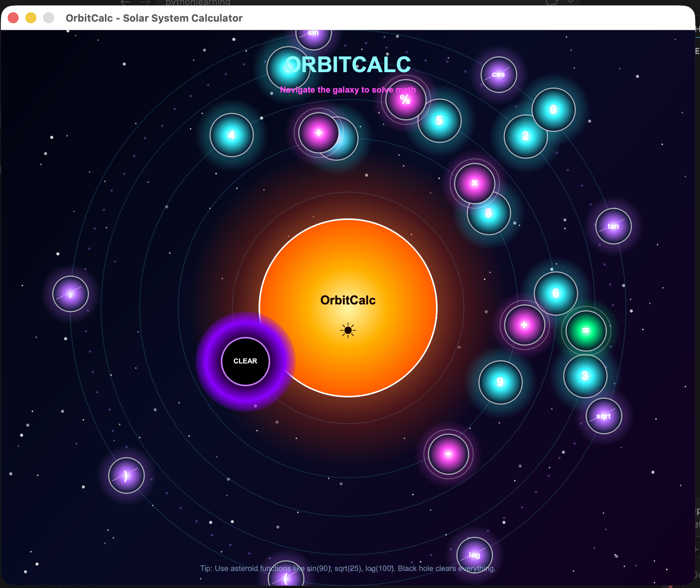

# 🌞 OrbitCalc — Solar System Calculator

**OrbitCalc** is a futuristic Python calculator where the solar system becomes the interface.  
Instead of normal buttons, numbers and operators orbit around a glowing Sun display like planets, moons, asteroids, and comets.

The goal of this project is to make math feel interactive, visual, and fun.

---

## 🚀 Demo



---

## ✨ Features

- ☀️ **Sun Display** — shows the current expression and final result
- 🪐 **Planet Buttons** — numbers `0–9`
- 🌙 **Moon Operators** — `+`, `−`, `×`, `÷`, `%`
- ☄️ **Comet Animation** — appears when pressing `=`
- 🌌 **Asteroid Belt Functions** — `sin`, `cos`, `tan`, `sqrt`, `log`
- 🕳️ **Black Hole Clear Button** — resets the calculator
- 🛸 **Hover Glow Effect** — buttons glow when the cursor moves over them
- 🌠 **Animated Space Background** — stars, orbit rings, and futuristic neon styling

---

## 🧠 Project Idea

OrbitCalc turns a normal calculator into a mini galaxy.

The center of the app is a glowing Sun that acts as the calculator display.  
Numbers and operators orbit around it like planets and moons. Scientific functions are placed like asteroids, and pressing equals triggers a comet-style animation.

This project was built to practice:

- Python GUI development
- PyQt6
- Custom drawing with `QPainter`
- Animation using `QTimer`
- Event handling
- Creative UI/UX design

---

## 🛠️ Technologies Used

- Python 3
- PyQt6
- QPainter
- QTimer
- Math module
- AST-based safe expression evaluation

---

## 📁 Project Structure

```text
calculator/
├── main.py
├── README.md
└── assets/
    └── image.png
# SolarCalculator
